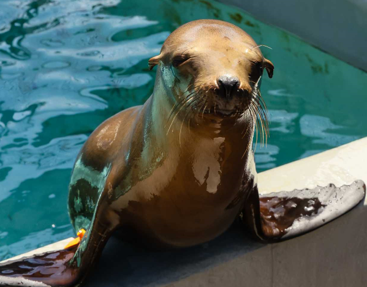

```{r setup, include=FALSE}
knitr::opts_chunk$set(echo = TRUE)
library(tidyverse)
library(here)
library(janitor)
library(lubridate)
library(tsibble)
library(stringr)
library(sf)
library(jpeg)
```

```{r}
mm_data_og <- read_csv(here("data", "mmhmap_secoora_json.csv")) %>% 
  clean_names() %>% 
  mutate(date = ymd(date)) %>% 
  mutate(month = month(date)) %>% 
  mutate(year = year(date)) %>%
  mutate(month = format(date, "%m"))

og_count <- mm_data_og %>% 
  group_by(year) %>% 
  count()

ggplot(data = og_count, aes(x = year,
                              y = n)) +
  geom_line() +
  theme_minimal() +
  labs(x = "Year",
       y = "Count Marine Mammals") +
  scale_x_continuous(limits = c(1961, 2013), n.breaks = 8)
```

```{r}
mm_tmmc <- mm_data_og %>% 
  filter(organization == "TMMC") %>% 
  separate(field_number, into = c("species", "number", sep = "-")) %>% 
  select(!"-") %>% 
  mutate(species = case_when(
    species == "CSL" ~ "California Sea Lion",
    species == "GFS" ~ "Guadalupe Fur Seal",
    species == "NFS" ~ "Northern Fur Seal",
    species == "C" ~ "Cetacean",
    species == "HS" ~ "Harbor Seal",
    species == "SSL" ~ "Stellar Sea Lion",
    species == "ES" ~ "Elephant Seal"
  )) %>% 
  mutate(year = as.character(year))
```

```{r}
# malnutrition
mal_mm <- mm_tmmc %>% 
  filter(health_category == "Malnutrition")

mal_mm_year <- mal_mm %>% 
  group_by(year) %>% 
  count()

mal_mm_month <- mal_mm %>% 
  group_by(year, month) %>% 
  count()

ggplot(data = mal_mm_year, aes(x = year,
                               y = n)) +
  geom_col() +
  theme_minimal() +
  labs(x = "Year",
       y = "Count Marine Mammals")

ggplot(data = mal_mm_month, aes(x = month,
                               y = n)) +
  geom_col() +
  theme_minimal() +
  labs(x = "Month",
       y = "Count Marine Mammals")
```

```{r}
infectious_mm <- mm_tmmc %>% 
  filter(str_detect(health_category, "Infectious"))

inf_year <- infectious_mm %>% 
  group_by(year) %>% 
  count()

inf_month <- infectious_mm %>% 
  group_by(year, month) %>% 
  count()

ggplot(data = inf_year, aes(x = year,
                            y = n)) +
  geom_col() +
  theme_minimal() +
  labs(x = "Year",
       y = "Count Marine Mammals")

ggplot(data = inf_month, aes(x = month,
                             y = n)) +
  geom_col() +
  theme_minimal() +
  labs(x = "Month",
       y = "Count Marine Mammals")
```


```{r}
mm_biotoxin <- mm_data_og %>% 
  filter(health_category == "Biotoxin") %>% 
  separate(geom, into = c("nothing", "latitude", "longitude"),sep = " ") %>% 
  mutate(latitude = str_replace(latitude, "\\(", "")) %>% 
  mutate(longitude = str_replace(longitude, "\\)", "")) %>% 
  select(!c(fid, health_category, nothing, tsn, organization)) %>% 
  mutate(date = ymd(date)) %>% 
  mutate(month = month(date)) %>% 
  mutate(year = year(date)) %>%
  mutate(month = format(date, "%m")) %>% 
  group_by(year, month) %>% 
  count()

mm_yearly <- mm_biotoxin %>% 
  group_by(year) %>% 
  count()

csl <- mm_data_og %>%
  filter(str_detect(field_number, "CSL")) %>% 
  mutate(date = ymd(date)) %>% 
  mutate(month = month(date)) %>% 
  mutate(year = year(date)) %>%
  mutate(month = format(date, "%m")) %>% 
  group_by(year) %>% 
  count()

csl_month <- mm_data_og %>% 
  filter(str_detect(field_number, "CSL")) %>% 
  mutate(date = ymd(date)) %>% 
  mutate(month = month(date)) %>% 
  mutate(year = year(date)) %>%
  mutate(month = format(date, "%m")) %>% 
  group_by(year, month) %>% 
  count()
```

```{r}
map_mm <- read_sf(here("data", "mmhmap_secoora_json", "mmhmap_secoora_jsonPoint.shp")) %>% 
  filter(organizati == "TMMC") %>% 
  mutate(date = ymd(date)) %>% 
  mutate(month = month(date)) %>% 
  mutate(year = year(date)) %>% 
  separate(field_numb, into = c("species", "number", sep = "-")) %>% 
  select(!"-") %>% 
  mutate(species = case_when(
    species == "CSL" ~ "California Sea Lion",
    species == "GFS" ~ "Guadalupe Fur Seal",
    species == "NFS" ~ "Northern Fur Seal",
    species == "C" ~ "Cetacean",
    species == "HS" ~ "Harbor Seal",
    species == "SSL" ~ "Stellar Sea Lion",
    species == "ES" ~ "Elephant Seal"
  ))

map_counties <- read_sf(here("data", "California_County_Boundaries", "cnty19_1.shp")) %>% clean_names()

st_crs(map_mm)
st_crs(map_counties)

st_transform(map_mm, 4326)

ggplot() +
  geom_sf(data = map_counties) +
  geom_sf(data = map_mm, aes(geometry = geometry)) +
  theme_minimal()
```





```{r}
averages <- mm_tmmc %>%
  group_by(year, month, species) %>% 
  count() %>% 
  group_by(month, species) %>% 
  mutate(average = mean(n)) %>% 
  select(!n) %>% 
  select(!year) %>% 
  unique()
```

```{r}
# harmful algal blooms
hab_events <- read_csv(here("data", "List.csv")) %>% 
  clean_names() %>% 
  filter(typeof_sign == c("Warning", "Danger", "Caution", "caution", "CAUTION", "WARNING")) %>% 
  filter(!str_detect(water_body_name, "Lake"))

leaflet() %>% 
  addProviderTiles("Esri.OceanBasemap") %>%
  addCircleMarkers(~longitude1, ~latitude1, data = hab_events, color = "red")
```

